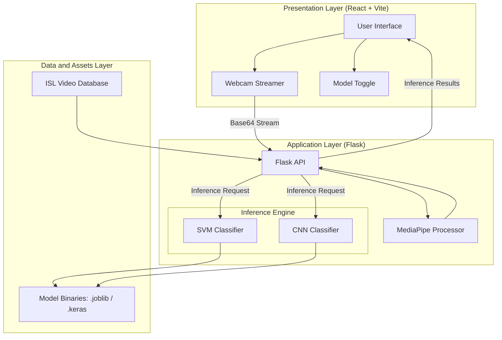

# Smart AI ISL Translator - System Architecture

## Table of Contents
1. [System Overview](#system-overview)
2. [Multilayered Architecture](#multilayered-architecture)
3. [Component Breakdown](#component-breakdown)
4. [Data Flow Analysis](#data-flow-analysis)
5. [Technology Stack](#technology-stack)
6. [API Specifications](#api-specifications)
7. [Subsystems and Assets](#subsystems-and-assets)

---

## System Overview
The Smart AI ISL Translator is a robust, bidirectional communication platform. The system leverages a decoupled, client-server architecture consisting of a Flask-based backend and a React/Vite-powered frontend. This design optimizes performance for real-time computer vision tasks and provides a responsive user experience.

### Core Capabilities
- **Sign-to-Text/Speech**: Real-time手势识别 (gesture recognition) using MediaPipe and machine learning classifiers.
- **Text-to-Sign**: Dynamic sequencing of Indian Sign Language (ISL) animation assets.
- **Service-Oriented Design**: The backend serves as a centralized inference engine for multiple client interfaces.

---

## Multilayered Architecture

The system is organized into distinct logical layers to ensure separation of concerns:

---

## Component Breakdown

### 1. Frontend Layer
- **Gesture Interface**: Manages the high-frequency webcam stream and live prediction rendering.
- **Model Configuration**: Enables user-defined switching between SVM and CNN classification engines.
- **Sign Visualization**: Coordinates the sequential playback of localized ISL video segments.

### 2. Backend Layer
- **Inference Engine**:
  - **Support Vector Machine (SVM)**: A high-performance classifier optimized for 126-dimensional landmark vectors.
  - **Convolutional Neural Network (CNN)**: A 1D deep learning model designed for complex pattern extraction.
- **Resilience Engineering**: A graceful fallback mechanism is implemented to ensure service availability. If the deep learning stack (TensorFlow) is unavailable, the system transparently routes all requests to the SVM engine.

---

## Data Flow Analysis

### Sign-to-Text Pipeline
1. **Acquisition**: The frontend captures raw video frames via the browser's MediaDevices API.
2. **Transmission**: Frames are transmitted as Base64-encoded strings to the `/api/predict` endpoint.
3. **Processing**:
    - The backend decodes the image and extracts 21 hand landmarks (per hand) via MediaPipe.
    - Coordinates are normalized relative to the wrist for position invariance.
    - The resultant 126-dimensional vector is passed to the selected inference engine.
4. **Delivery**: The backend returns a JSON payload containing the predicted label and a statistical confidence score.

### Text-to-Sign Pipeline
1. **Input**: User provides natural language text input.
2. **Analysis**: The backend tokenizes the text into a sequence of known ISL tokens.
3. **Mapping**: Words are mapped to specific MP4 assets. Unknown words are decomposed into character-level tokens for spelling.
4. **Visualization**: The frontend receives an ordered list of URLs and executes sequential playback.

---

## Technology Stack

| Component | Technology |
| :--- | :--- |
| **Frontend** | React 18, Vite, CSS3 |
| **Backend Framework** | Flask, Flask-CORS |
| **Computer Vision** | MediaPipe, OpenCV |
| **Machine Learning** | scikit-learn, TensorFlow |
| **Audio Processing** | Google Text-to-Speech (gTTS) |

---

## API Specifications

### Prediction Endpoint
- **URL**: `POST /api/predict`
- **Payload**: `{ "frame": "base64_string" }`
- **Returns**: `{ "label": "string", "confidence": "float" }`

### Translation Endpoint
- **URL**: `POST /api/text-to-sign`
- **Payload**: `{ "text": "string" }`
- **Returns**: `{ "clips": ["string"] }`

---

## Subsystems and Assets
- **isl_sign2text**: Repository for dataset curation and model training pipelines.
- **isl_text2sign**: Centralized repository for ISL video assets and processing scripts.
- **Inference Binaries**: Pre-trained weights for SVM and CNN models stored in a version-controlled directory.

---

## Security and Performance
- **Latency Optimization**: Per-frame processing is tuned to achieve sub-100ms response times.
- **Data Privacy**: All video processing is performed transiently in memory without persistent storage of user frames.
- **Deployment**: The architecture is designed for containerization via Docker, supporting scalable deployment on cloud platforms.
