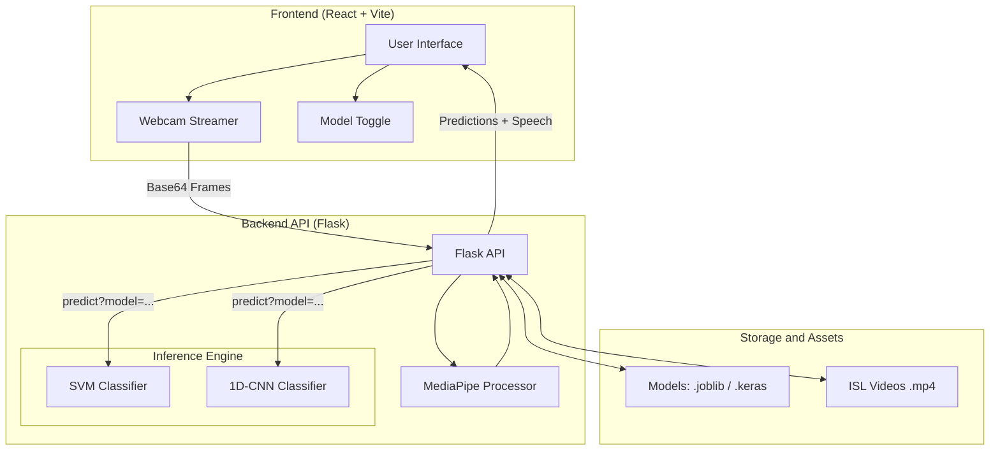

# Smart AI-Powered ISL Translator
> "Bridging the communication gap with a modern, real-time Flask-React architecture."

[](https://github.com/Darshanmp1/isl-translator)
[](https://github.com/Darshanmp1/isl-translator/tree/main/backend)
[](https://github.com/Darshanmp1/isl-translator/tree/main/frontend)

---

## Project Overview
The Smart AI ISL Translator is a high-performance, bidirectional communication system designed to facilitate interaction for the hearing-impaired community. The platform utilizes a decoupled architecture to ensure scalability and real-time responsiveness.

- **Automated User Interface**: A responsive frontend built with React 18 and Vite, featuring low-latency webcam streaming and dynamic model selection.
- **Hybrid Machine Learning Backend**: A Flask-based API serving a dual-model inference engine (SVM and 1D-CNN) for robust gesture recognition.
- **Bidirectional Translation Workflow**:
    - **Sign-to-Text**: Real-time hand landmark extraction using MediaPipe, processed via 126-dimensional feature vectors.
    - **Text-to-Sign**: Sequential animation of Indian Sign Language (ISL) video assets with a character-level fallback mechanism.
- **Speech Synthesis Integration**: High-quality multilingual audio output powered by gTTS.

---

## System Architecture
The application architecture is designed for modularity and high throughput between the vision processing layer and the user interface.



---

## Model Architectures
The system implements a tiered classification strategy to balance inference speed and analytical depth.

| Engine | Methodology | Feature Set | Performance Characteristics |
| :--- | :--- | :--- | :--- |       
| **SVM** | Support Vector Machine | RBF Kernel, 126-dim landmarks | Optimized for low-latency CPU inference. |
| **CNN** | Deep Learning | 1D-Convolutional Neural Network | Enhanced pattern recognition for complex hand shapes. |

> [!IMPORTANT]
> **Fault Tolerance**: The backend includes a graceful fallback mechanism. If deep learning dependencies are unavailable, the system automatically redirects all traffic to the SVM engine to maintain continuous service.

---

## Installation and Deployment

### 1. Environment Configuration
It is recommended to use an isolated environment for dependency management:
```bash
conda create -n isl_env python=3.10
conda activate isl_env
pip install -r backend/requirements.txt
```

### 2. Backend Execution
Initialize the Flask server:
```bash
cd backend
python app.py
```

### 3. Frontend Execution
Launch the React development server:
```bash
cd frontend
npm install
npm run dev
```

---

## Directory Structure
```text
isl-translator/
├── backend/                # Flask API and inference logic
├── frontend/               # React/Vite user interface
├── isl_sign2text/          # Machine learning core and training pipelines
│   ├── models/             # Serialized model binaries (.joblib / .keras)
│   └── 03_train_cnn.py     # CNN training script
├── isl_text2sign/          # Video data and assets
└── ARCHITECTURE.md         # Technical design documentation
```
 
---

## Technology Stack
- **Frontend**: React 18, Vite, CSS3
- **Backend**: Flask, Flask-CORS, gTTS
- **Machine Learning**: MediaPipe, scikit-learn, TensorFlow/Keras, NumPy
---

## 📜 License
Licensed under the MIT License.
